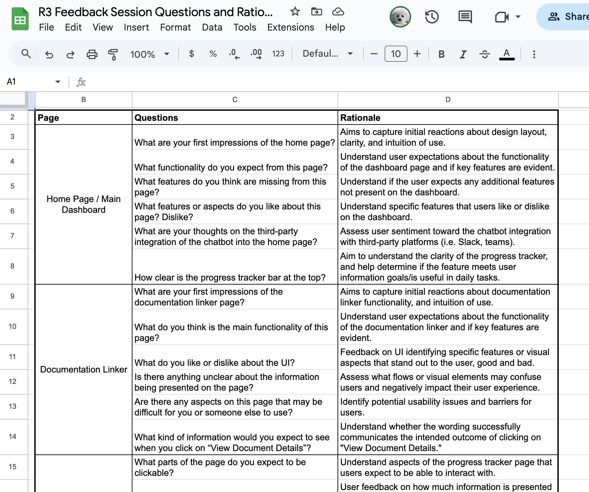
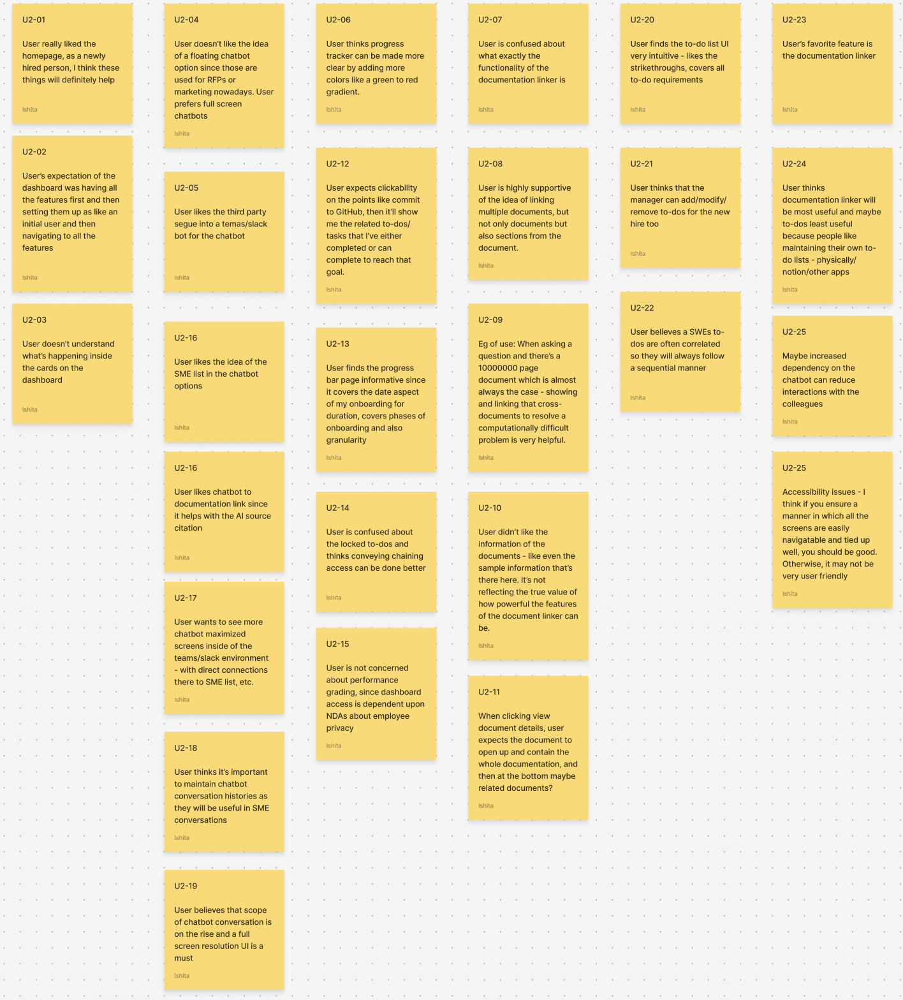
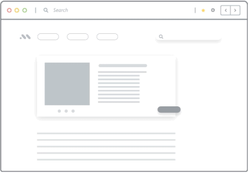
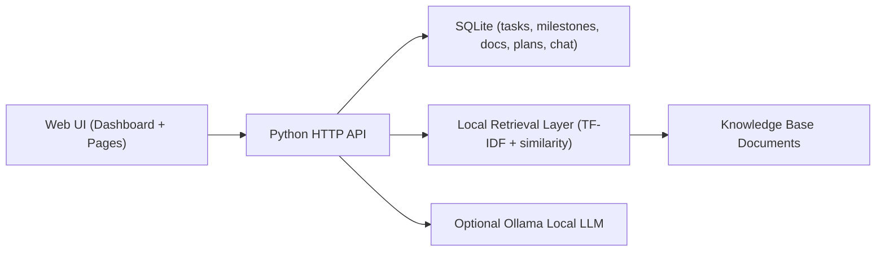

# NeoBoard: AI-Driven New-Hire SWE Onboarding Platform

NeoBoard is an AI-assisted onboarding platform designed from team research artifacts (R1-R4) to solve one core problem: **new software engineers lose momentum because onboarding knowledge is fragmented across docs, tools, people, and phases**.

This repository contains the full local app implementation: dashboard, phased tasks, progress planning, documentation linker, and AI assistant.

## Research + Team Context

This system was built from a multi-phase research process with the team:

- **R1 (Problem framing + proposal):** defined onboarding friction points in knowledge access, permissions, setup, and task dependency.
- **R2 (Concept exploration):** designed early interaction flows for checklist guidance and contextual nudges.
- **R3 (Prototype iteration):** refined feature structure into task progression, document support, and assistant-style help.
- **R4 (Final integration):** combined progress tracking, documentation guidance, and AI support into one platform experience.

### Key research insights translated into product behavior

1. New hires need **phase-aware guidance**, not a flat task list.
2. Documentation should answer: **"Where exactly do I look next?"**
3. Progress is not only task completion; it also includes **knowledge acquisition**.
4. A support assistant should provide both **summary** and **source-grounded direction**.

## Product Overview

NeoBoard includes five integrated surfaces:

1. **Dashboard:** live overview of progress, current tasks, docs, and quick assistant entry.
2. **To-Do Workflow:** pre-seeded SWE tasks with locked phase progression.
3. **Progress Planner:** weighted progress, weekly plans, and activity calendar.
4. **Documentation Linker (KB Lookup):** AI summary + page/paragraph guidance across linked docs.
5. **Onboarding Assistant:** retrieval-based Q&A with citations, optional local LLM response path.

## Research Artifacts (Images)

### Research Prototype View


### Research Flow Snapshot


### Whatfix-style Guidance Reference


## System Architecture



## Feature Details

### 1) Phased SWE Task Progression

- Pre-seeded onboarding tasks are grouped by onboarding phase:
  - Complete training
  - Unlock all accesses
  - Debug codebase
  - Commit to GitHub
- **Unlock rule:** phase N+1 tasks remain locked until all tasks in phase N are completed.
- Milestones sync automatically from phase completion state.

### 2) Documentation Linker (Lookup-first)

The documentation page is intentionally lookup-first for new hires:

- Enter a doubt/question.
- System returns:
  1. **AI summary** of the most relevant content.
  2. **Guided lookup steps** with doc title + page + paragraph.
  3. **Cross-doc fallback path** if answer is incomplete in first source.
- Docs can be marked as read; read activity contributes to progress.

### 3) Progress as Behavior + Learning

Progress is weighted across:

- Milestone completion
- Task completion
- Documents read
- Weekly plans completed

Progress page includes:

- Current overall percentage + phase
- Weekly plan management (add/update/complete/delete)
- Calendar activity table (tasks done + docs read by day)

### 4) AI Assistant Integration

- Retrieval-first response generation using local KB documents.
- Optional Ollama model path for local LLM generation.
- Citations included in responses.
- Fallback behavior remains local and deterministic when LLM unavailable.

## Tech Stack

- **Backend:** Python (`http.server`-based API)
- **Storage:** SQLite
- **Frontend:** HTML/CSS/Vanilla JS (multi-page)
- **ML (local):** TF-IDF retrieval, cosine similarity linking, extractive summarization
- **LLM (optional):** Ollama local models

## Repository Structure

```text
NeoBoard-Onboarding-App/
├── server.py
├── web/
│   ├── index.html
│   ├── progress.html
│   ├── tasks.html
│   ├── docs.html
│   ├── assistant.html
│   ├── app.js
│   └── styles.css
├── docs/
│   └── images/
│       ├── research-prototype.png
│       ├── research-flow.png
│       └── whatfix-flow.gif
└── README.md
```

## Run Locally

```bash
cd "/Users/ishitadatta/GeorgiaTech/Sem 1/Research methods/Project/NeoBoard-Onboarding-App"
python3 server.py
```

Open:

- [http://127.0.0.1:8787](http://127.0.0.1:8787)

## Optional Local AI Extensions

- PDF ingestion: `pip install pypdf`
- DOCX ingestion: `pip install docx2txt`
- Local LLM path: install Ollama and pull a model (example: `llama3.2`)

## Team-to-Engineering Traceability

This implementation intentionally keeps a direct line from research to system behavior:

- **Research finding:** onboarding is non-linear and role-dependent.
  - **Implementation:** phased unlock workflow + weekly planning.
- **Research finding:** docs are hard to navigate under pressure.
  - **Implementation:** summary-first + page/paragraph guidance with fallback steps.
- **Research finding:** progress should reflect readiness, not only checkboxes.
  - **Implementation:** weighted progress with task + doc-read + plan signals.

## Future Work

- Team-level manager dashboard (cohort analytics)
- Fine-grained role templates (backend/frontend/devops paths)
- Better citation grounding with paragraph-level retrieval chunks
- Automated onboarding risk alerts based on delayed progression

---

For collaboration or feedback: **isheeta50@gmail.com**
